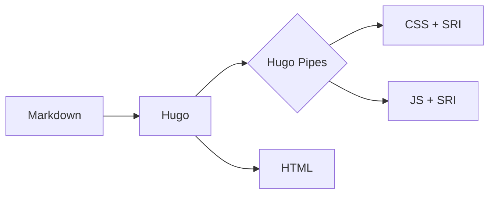

+++
title = '代码高亮与 Mermaid 图表'
date = '2025-11-23'
description = '演示 Chaos 主题的语法高亮与 Mermaid 图表，两者都会跟随深浅色模式切换。'
categories = ['写作']
tags = ['代码高亮', 'Mermaid', 'Go', 'Python']
+++

代码块使用 Hugo 内置的 Chroma 高亮，并为浅色和深色模式分别准备了配色；
Mermaid 只会在包含图表的页面上加载。

<!--more-->

## 代码高亮

```go
package main

import "fmt"

// logistic 返回逻辑斯谛映射的下一个值。
func logistic(r, x float64) float64 {
	return r * x * (1 - x)
}

func main() {
	x := 0.2
	for i := 0; i < 5; i++ {
		x = logistic(3.9, x)
		fmt.Printf("%d: %.6f\n", i, x)
	}
}
```

```python
def lorenz(x, y, z, sigma=10.0, rho=28.0, beta=8 / 3):
    """洛伦兹系统的导数。"""
    return sigma * (y - x), x * (rho - z) - y, x * y - beta * z
```

## Mermaid 图表


