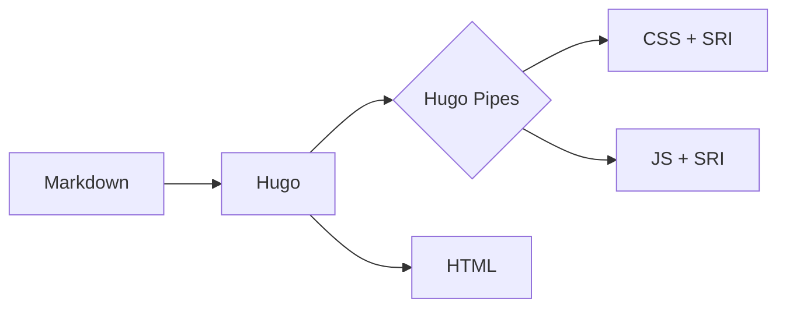
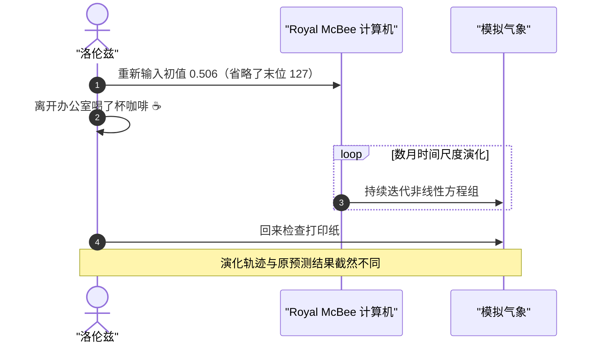

代码块由Hugo内置的[Chroma](https://github.com/alecthomas/chroma)引擎在构建时预先完成静态高亮渲染，
并为浅色与深色模式分别提供适配的配色方案；
[Mermaid](https://mermaid.js.org/)图表则仅在包含图表定义的页面中按需加载。

<!--more-->

## 代码语法高亮与剪贴板交互

代码语法高亮直接在站点构建期由Chroma引擎预先生成静态HTML，
客户端无需加载外部语法高亮脚本。代码块右上角提供复制按钮，
通过原生[Clipboard API](https://developer.mozilla.org/en-US/docs/Web/API/Clipboard_API)
实现文本复制。

以下为计算[逻辑斯谛映射](https://zh.wikipedia.org/wiki/%E9%80%BB%E8%BE%91%E6%96%AF%E8%B0%9B%E6%98%A0%E5%B0%84)(Logistic map)的示例代码。
当控制参数 \(r = 3.9\) 时，该非线性迭代系统将进入混沌区间：

```go
package main

import "fmt"

// logistic 返回逻辑斯谛映射的下一个值。
func logistic(r, x float64) float64 {
	return r * x * (1 - x)
}

func main() {
	x := 0.2
	for i := 0; i < 5; i++ {
		x = logistic(3.9, x)
		fmt.Printf("%d: %.6f\n", i, x)
	}
}
```

以下为[洛伦兹系统](https://zh.wikipedia.org/wiki/%E6%B4%9B%E4%BC%A6%E8%8C%A8%E5%90%B8%E5%BC%95%E5%AD%90)常微分方程组的导数计算函数：

```python
def lorenz(x, y, z, sigma=10.0, rho=28.0, beta=8 / 3):
    """洛伦兹系统的导数。"""
    return sigma * (y - x), x * (rho - z) - y, x * y - beta * z
```

## Mermaid图表

在Markdown中使用 ```` ```mermaid ```` 代码块即可直接声明图表：

> [!NOTE]
> 代码语法高亮在构建阶段完成，无客户端运行时开销；而Mermaid则需浏览器在前端动态解析并计算图形布局。
> 虽然该脚本仅在包含图表的页面按需加载，但仍需传输约750 KB（Brotli压缩，解压后约3570 KB）。
> 若对单页体积有严格要求，可以考虑在构建前通过命令行工具将图表预渲染为静态SVG图片后再行引入。

### 示例1：构建流程图




### 示例2：时序图（洛伦兹的咖啡时间）

1961年气象模拟中那次著名的「舍入误差」：

````markdown

````

渲染效果如下：


