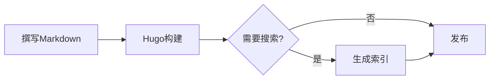

这一页不讲道理，只排样：把主题能渲染的组件按固定顺序放在一起，
调整配色或排版之后，在浅色与深色模式下各看一遍，就能发现哪里出了问题。

<!--more-->

## 正文与行内元素 {#inline}

正文段落使用**粗体**、*斜体*与***粗斜体***，也可以~~删除~~一段文字。
行内代码如`errno`和`printf("%d\n", x)`使用等宽字体，
链接分为[站内链接](../../archives/)与[站外链接](https://gohugo.io/ "Hugo官方网站")两种。
中文与English、数字2026之间不手动加空格，由CSS自动留出间距。
注音有[漢字]{かんじ}、[汉字]^(hàn zì)与[临时方案]{永久保留}三种用法。
脚注标记出现在句末[^note]，正文末尾会列出脚注内容。

A paragraph in English checks the Latin side of the type: quotation marks "like these",
an em dash --- like this --- and an ellipsis... all pass through the typographer.

### 三级标题

#### 四级标题

四级标题以下很少使用，这里只确认层级关系依然清楚。

## 列表 {#lists}

- 无序列表的第一项
- 第二项包含较长的文字，用来检查换行之后的悬挂缩进是否与首行文字对齐，而不是与项目符号对齐
  - 嵌套的第二层
    - 嵌套的第三层
- 第三项

1. 有序列表
2. 第二步
   1. 嵌套的有序列表
   2. 第二个子项
3. 第三步

- [x] 已完成的任务
- [ ] 尚未完成的任务

术语
: 定义列表的解释部分。

## 引用 {#quotes}

> 引用使用无边框的浅色底块，字号略小于正文，但颜色不变淡。
>
> > 嵌套的引用。
>
> 引用里也可以有`行内代码`和[链接](https://commonmark.org/)。

## 提示框 {#callouts}

> [!NOTE]
> NOTE：背景信息与补充说明，含一个[链接](https://example.org/)。

> [!TIP]
> TIP：使用技巧与建议。

> [!IMPORTANT]
> IMPORTANT：必须了解的关键前提。

> [!WARNING]
> WARNING：需要特别注意的警示。

> [!CAUTION]
> CAUTION：可能造成严重后果的操作。

> [!HISTORICAL]
> HISTORICAL：内容已过时，仅作存档。

> [!DISCLAIMER]
> DISCLAIMER：免责声明。

> [!NOTE] 带自定义标题和代码的提示框
> 提示框里的代码块：
>
> ```sh
> sysctl kern.osreldate
> ```

## 表格 {#tables}

| 色名 | 读音 | 色值 | 用途 |
| :--- | :--- | :---: | ---: |
| 生成り色 | Kinari-iro | `#FBFAF5` | 页面底色 |
| 練色 | Neri-iro | `#EDE4CD` | 悬停与选中 |
| 蘇芳 | Suō | `#9E3D3F` | 主色 |
| 藍色 | Ai-iro | `#165E83` | 链接 |
| 墨 | Sumi | `#595857` | 次要文字 |

较宽的表格应在窄屏上横向滚动，而不是撑破版面：

| 参数 | 默认值 | 最小值 | 最大值 | 单位 | 说明 |
| :--- | ---: | ---: | ---: | :---: | :--- |
| `vfs.zfs.arc_max` | 0 | 67108864 | 物理内存 | 字节 | ARC缓存的上限，0表示由系统自动决定 |
| `kern.maxfiles` | 自动 | 1024 | 2147483647 | 个 | 系统范围内可同时打开的文件数 |

## 代码 {#code}

不足五行的代码块不显示行号：

```sh
$ uname -r
15.0-RELEASE
```

五行以上的代码块显示行号，并高亮第8至9行。这段C代码同时用到关键字、预处理指令、
字符串、数值、函数名与注释：

```c {hl_lines=[8,9]}
#include <stdio.h>
#include <stdlib.h>

#define ITERATIONS 5

/* 逻辑斯谛映射：r 在 3.9 附近进入混沌区间 */
static double
logistic(double r, double x)
{
	return (r * x * (1.0 - x));
}

int
main(void)
{
	double x = 0.2;

	for (int i = 0; i < ITERATIONS; i++) {
		x = logistic(3.9, x);
		printf("%d: %.6f\n", i, x);
	}
	return (EXIT_SUCCESS);
}
```

Python代码检查类名、装饰器与内置函数的配色：

```python
from dataclasses import dataclass


@dataclass
class Colour:
    """一种传统色。"""
    name: str
    hex: str

    def rgb(self) -> tuple[int, int, int]:
        # 去掉开头的「#」，每两位一组
        return tuple(int(self.hex[i:i + 2], 16) for i in (1, 3, 5))


print(Colour("蘇芳", "#9E3D3F").rgb())
```

HTML代码检查标签与属性的配色：

```html
<figure class="x-card" id="x-404015814665195520">
  
  <figcaption>色票</figcaption>
</figure>
```

差异代码检查增删行的底色：

```diff
--- a/tokens.css
+++ b/tokens.css
@@ -193,3 +193,3 @@
-      --bg: #1F1E1D;
+      --bg: #151514;
       --surface: #1B1B19;
```

没有语言标记的预格式文本：

```
+--------+     +--------+
| client | --> | server |
+--------+     +--------+
```

## 公式 {#math}

行内公式\(e^{i\pi} + 1 = 0\)与正文同行排列，独立公式居中显示：

$$
x_{n+1} = r\,x_n\,(1 - x_n), \qquad r \in [0, 4]
$$

## 图表 {#diagram}



## 图片 {#image}

页面包中的图片会生成多种尺寸与WebP版本：


## 嵌入卡片 {#embed}

X（Twitter）的帖子从构建时缓存的数据渲染成静态卡片，不加载第三方脚本：



## 分隔线 {#rule}

分隔线上方的段落。

---

分隔线下方的段落。

[^note]: 脚注的内容出现在文章末尾，带有返回正文的链接。
